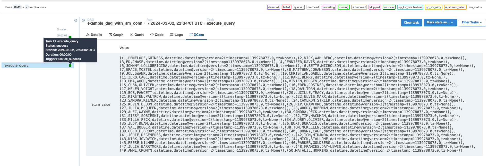

# MWAA Secrets Manager Backend Example to Connect to a Database

This documentation demonstrates how to use Secrets Manager with the Amazon Managed Airflow Instance (aka MWAA) to connect to a database.

# Why create this example?
The code provided by this [AWS Documentation](https://docs.aws.amazon.com/mwaa/latest/userguide/samples-secrets-manager.html) is confusing. It does not fully demonstrate how to use the secret natively with Airflow.

I wanted to update the documentation [at Amazon MWAA User Guide docs](https://github.com/awsdocs/amazon-mwaa-user-guide), but unfortunately [they were retired](https://aws.amazon.com/blogs/aws/retiring-the-aws-documentation-on-github/).

Hopefully this will help someone out there who is trying to get started with MWAA.

# Getting Started
## Scenario
Assume that you have an AWS account. You want to store a secret named `airflow/connections/my_mysql_instance` and use it in Airflow.

## Secrets Manager Backend for Local Runner Setup
1. Create a secret named `airflow/connections/my_mysql_instance`.
   ```shell
   aws secretsmanager create-secret \
    --name airflow/connections/my_mysql_instance \
    --description "My sample mysql instance" \
    --secret-string "{\"user\":\"sakila\",\"password\":\"p_ssW0rd\",\"engine\":\"mysql\",\"host\":\"sakiladbhost\",\"port\":\"3306\",\"database\":\"sakila\"}"
   ```
2. Update secrets manager backend config at [docker/config/airflow.cfg](docker/config/airflow.cfg).
   ```
   [secrets]
   # Full class name of secrets backend to enable (will precede env vars and metastore in search path)
   # Example: backend = airflow.providers.amazon.aws.secrets.systems_manager.SystemsManagerParameterStoreBackend
   backend = airflow.providers.amazon.aws.secrets.secrets_manager.SecretsManagerBackend

   # The backend_kwargs param is loaded into a dictionary and passed to __init__ of secrets backend class.
   # See documentation for the secrets backend you are using. JSON is expected.
   # Example for AWS Systems Manager ParameterStore:
   # ``{{"connections_prefix": "/airflow/connections", "profile_name": "default"}}``
   backend_kwargs = {"connections_prefix" : "airflow/connections", "variables_prefix" : null, "config_prefix" : null}
   ```

3. Refer to the dag code in [dags/example_dag_with_sm_conn.py](dags/example_dag_with_sm_conn.py) and create a DAG which uses the SQLExecuteQueryOperator.
   Note the `conn_id` parameter, which has the secret name supplied **without** the prefix.
   For example: Secret name `airflow/connections/my_mysql_instance` => Conn ID `my_mysql_instance`
   ```python
    execute_query = SQLExecuteQueryOperator(
        task_id="execute_query",
        conn_id="my_mysql_instance",  # Omit the 'airflow/connections' prefix defined in the name of the secret in Secrets Manager
        sql=f"SELECT 1;"
    )
   ```

4. Configure credentials in `~/.aws/credentials` to contain a `default` profile which has AWS Administrator permissions. To set that up, see [this doc](https://docs.aws.amazon.com/cli/latest/userguide/getting-started-quickstart.html#getting-started-quickstart-new).


## Local Demo
1. Build image
   ```shell
   ./mwaa-local-env build-image
   ```

2. Start docker compose app
   ```shell
   ./mwaa-local-env start
   ```

3. Navigate to http://0.0.0.0:8080, login as Username: `admin`, Password: `test`.
4. Click on the play button for example_dag_with_sm_conn DAG. 
   
5. Then, click on the dag itself, that will lead you to the DAG statuses like below:
    
6. Click on the execute_query button, and then click on `XCom` to see the data that was retrieved by the operator. Success!
   

# Secrets Manager Backend for an actual MWAA Environment
1. Follow steps in [secrets manager backend for local runner setup](#secrets-manager-backend-for-local-runner-setup), but change the following:
   * In the actual MWAA environment, you can specify the same settings as shown in the below CloudFormation template snippet:
        ```yaml
        Environment: 
            Type: "AWS::MWAA::Environment"
                Properties: 
                AirflowConfigurationOptions: 
                    core.default_timezone: utc
                    logging.logging_level: INFO
                    secrets.backend: airflow.providers.amazon.aws.secrets.secrets_manager.SecretsManagerBackend
                    # Make sure the secrets.backend_kwargs value is defined as a string
                    secrets.backend_kwargs: '{"connections_prefix" : "airflow/connections", "variables_prefix" : null, "config_prefix" : null}'
                # Other properties goes here...
        ```
    * Since MWAA uses the execution role to fetch the secret, make sure that the execution role has sufficient permissions to view the secret. See [step one](https://docs.aws.amazon.com/mwaa/latest/userguide/connections-secrets-manager.html#connections-sm-policy) for the required permissions.

# Resources
* See here for the official guide for secretsmanager backend: https://airflow.apache.org/docs/apache-airflow-providers-amazon/stable/secrets-backends/aws-secrets-manager.html#storing-and-retrieving-variables